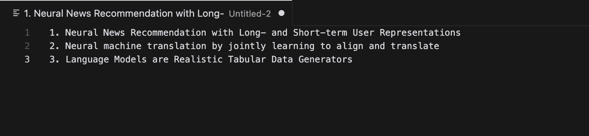
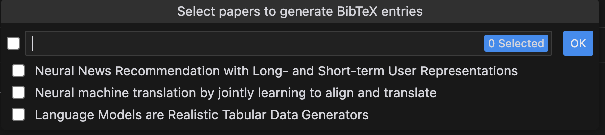
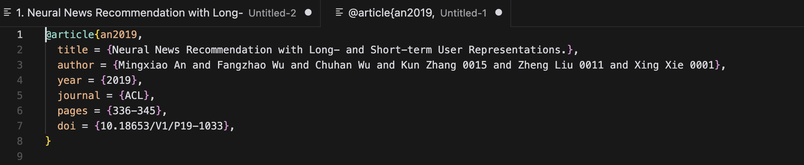

# AutoBib

## Features

AutoBib is a bibliography management tool for scientists.

Given a list of paper titles, AutoBib automatically generates the BibTeX entries for you.

The BibTeX entry will be generated in a new editor tab.

